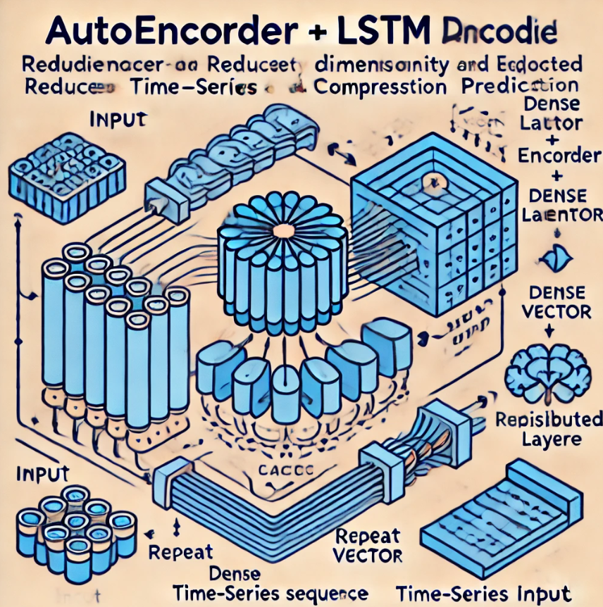

# Multi-Window LSTM Autoencoder for Time Series Data Compression and Prediction

This Python code implements an **Autoencoder** using **LSTM** for time series data, where each feature has a different time window interval. Here's an overview of its functionality:

1. **Data Preprocessing**: 
   - The code reads multiple CSV files and merges them into a single DataFrame. 
   - The user can select relevant features and map specific window sizes to each feature, which applies sliding windows to form time-series sequences.
   - It normalizes the data using **MinMaxScaler** to ensure the values are within a uniform range.

2. **Autoencoder-LSTM Model**:
   - An **Autoencoder** with an LSTM layer is used to compress (encode) and reconstruct (decode) the time series data.
   - The encoder uses **LSTM** units to capture temporal patterns, and the decoder reconstructs the sequence using **RepeatVector** and **TimeDistributed** layers.
   
3. **Hyperparameter Tuning**:
   - **KerasTuner** is used for tuning hyperparameters like the number of LSTM units, latent space dimensions, and learning rate. The best model is selected based on validation loss.
   
4. **Model Training and Evaluation**:
   - The model is trained on time-series data, and the best model is saved after hyperparameter optimization.
   - The model is then used to make predictions on the test data, and the results are evaluated and saved for further analysis.

This approach is useful for anomaly detection, trend discovery, or feature compression in time series data with varying window sizes per feature.

